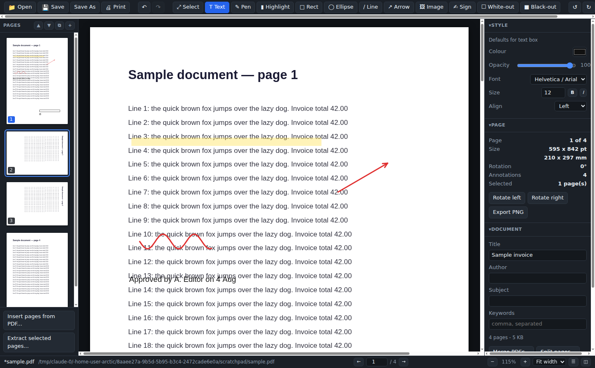

# Arctic PDF Editor

A desktop PDF editor for Windows. Open a PDF, mark it up, rearrange its pages,
fill in its forms, and save a real PDF back out — no cloud service, no uploads,
no page limits.

Built with Electron, [pdf.js](https://mozilla.github.io/pdf.js/) for rendering
and [pdf-lib](https://pdf-lib.js.org/) for writing.



## What it does

**Annotate**

- Text boxes with the built-in PDF fonts (Helvetica/Arial, Times, Courier),
  bold/italic, size, colour and alignment — written as *real selectable text*,
  not a picture of text
- Freehand pen, highlighter, rectangles, ellipses, lines and arrows
- Images (PNG/JPEG) and a signature pad you draw with the mouse or a pen
- White-out and black-out boxes for covering content
- Select, move, resize, reorder (front/back), nudge with the arrow keys, delete
- Undo/redo across everything, including page operations

**Pages**

- Reorder by dragging thumbnails, move up/down, duplicate, delete
- Rotate one page or a whole selection
- Insert blank pages, or insert pages from another PDF
- Merge several PDFs, extract a selection to a new file, or split one file per page

**Documents**

- Fill interactive form fields (text, checkbox, radio, dropdown, list) and
  optionally flatten them so the values become permanent
- Edit title, author, subject and keywords
- Find text across the document with match highlighting
- Print, and export any page as a 300 dpi PNG
- Opens password-protected PDFs (you are prompted for the password)

Files open by drag-and-drop, from the File menu, or by double-clicking a `.pdf`
once the installer has registered the file association.

## Install on Windows

Download `Arctic PDF Editor-<version>-x64.exe` from the
[releases page](https://github.com/zerzall/arctic/releases) and run it.

- Installs per user, so **no administrator rights are needed**
- Lets you choose the install directory, and creates Start-menu and desktop shortcuts
- Uninstall from *Settings → Apps* like any other program

There is also a `-portable.exe` build that runs straight from a folder or a USB
stick without installing anything.

> The installer is not code-signed, so Windows SmartScreen will show a
> "Windows protected your PC" notice the first time. Choose **More info →
> Run anyway**, or build it yourself from source with the steps below.

## Build it yourself

Requirements: [Node.js](https://nodejs.org/) 20 or newer. Building the Windows
installer must happen on Windows (electron-builder needs Windows tooling for the
NSIS target).

```bash
git clone https://github.com/zerzall/arctic.git
cd arctic
npm install          # also copies pdf.js/pdf-lib into src/renderer/vendor
npm start            # run the app from source
npm test             # 27 tests over the geometry and PDF-writing code
npm run dist:win     # -> dist/Arctic PDF Editor-1.0.0-x64.exe (+ portable)
```

`npm run icon` regenerates `build/icon.ico` (needs Python 3; the icon is drawn
by `scripts/make-icon.py` rather than committed as an opaque binary).

Pushing to this repository also builds the installer on a Windows runner — see
[`.github/workflows/build-windows.yml`](.github/workflows/build-windows.yml).
Tagging a commit `v1.0.0` attaches the installer to a GitHub release.

## Keyboard shortcuts

| Keys | Action |
| --- | --- |
| `Ctrl+O` / `Ctrl+S` / `Ctrl+Shift+S` | Open / Save / Save As |
| `Ctrl+P` | Print |
| `Ctrl+F`, `F3`, `Shift+F3` | Find, next match, previous match |
| `Ctrl+Z` / `Ctrl+Y` | Undo / redo |
| `Ctrl+D` | Duplicate the selected object (or pages) |
| `Ctrl+[` / `Ctrl+]` | Rotate the selected pages |
| `Ctrl++` / `Ctrl+-` / `Ctrl+0` | Zoom in / out / 100% |
| `Ctrl`+scroll | Zoom |
| `V T D H R E L A` | Select, Text, Pen, Highlight, Rect, Ellipse, Line, Arrow |
| `Delete` | Delete the selected object, or the selected pages |
| Arrow keys | Nudge the selection (`Shift` for 10pt steps) |
| `F4` / `F8` | Toggle the thumbnail and properties panels |

## How it works

```
src/main/       Electron main process: window, menus, dialogs, file IO, printing
  main.js         also serves the UI over a custom app:// scheme
  preload.js      the only bridge the renderer gets (contextIsolation is on)
src/renderer/
  js/geometry.js  view space <-> PDF user space, for every page rotation
  js/textlayout.js line breaking, shared by the screen and the file
  js/export.js    the PDF writer (pdf-lib) - no DOM, so Node can test it
  js/overlay.js   the same shapes drawn on a canvas
  js/model.js     document model, undo history, event bus
  js/viewer.js    pdf.js rasterisation, mouse tools, text editing
  js/thumbs.js    page rail with drag-to-reorder
  js/panels.js    style / page / metadata / form-field inspector
  js/search.js    text extraction and match highlighting
```

Two design decisions are worth calling out:

**Annotations are stored in view space.** Coordinates are kept exactly as the
user sees them — top-left origin, in points, on the *rotated* page — and are
converted to PDF user space only when writing. `geometry.js` holds that
conversion for all four rotations, and `export.js` and `overlay.js` are twins:
one draws to a PDF, the other to a canvas, from the same numbers. That is what
makes the editor WYSIWYG on rotated pages.

**Saving prefers editing the original file over rebuilding it.** If you have not
changed the page order, the original document is loaded, annotated and written
back, so its bookmarks, links and interactive form fields survive untouched. If
pages were reordered, inserted or deleted, the document is rebuilt from copied
pages instead, and form fields are flattened first (with a warning) because
copied pages cannot carry an AcroForm with them.

## Known limitations

- **Black-out boxes are not redaction.** They cover content visually; the text
  underneath is still in the file and can be extracted. Do not use them to hide
  sensitive information.
- **Existing text on a page cannot be re-typed.** You can cover it and put a new
  text box on top, which is what most PDFs allow in practice, but there is no
  reflowing of the original text.
- **Text uses the 14 built-in PDF fonts**, which are WinAnsi-encoded. Characters
  outside that range (CJK, for example) are replaced with `?` and the app warns
  you when it happens.
- **Saving a password-protected PDF writes an unprotected copy.** The editor can
  open encrypted files but does not re-encrypt on save.
- Reordering pages of a form document flattens the form (see above).

## Licence

MIT — see [LICENSE](LICENSE). pdf.js is Apache-2.0, pdf-lib is MIT; both are
vendored into `src/renderer/vendor` at install time by `scripts/copy-vendor.js`.
