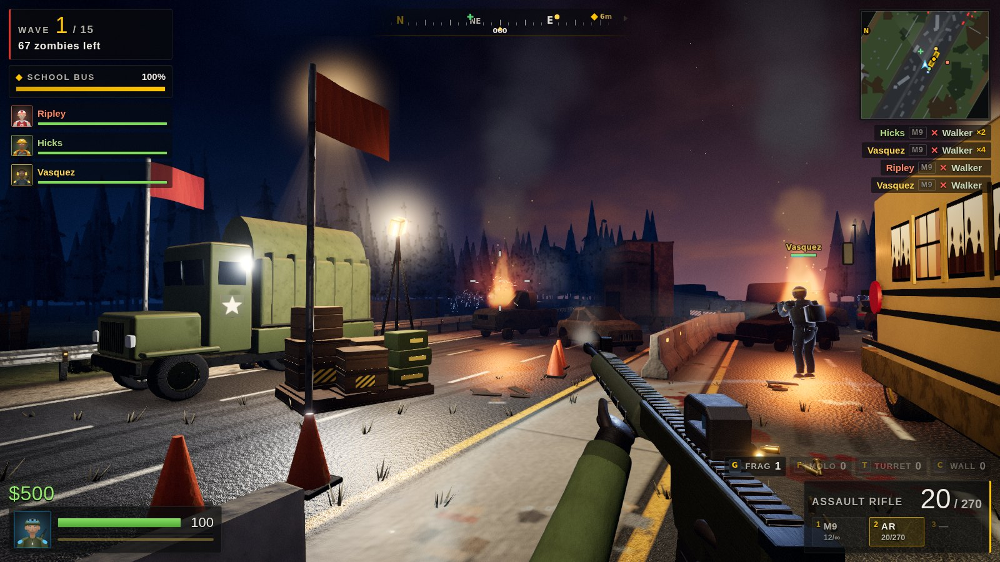

# Highway Horde

A first-person co-op zombie shooter for 1–6 players that runs in the browser. Pick a
survivor, hold the line on a jammed highway, a desert truck stop, a river bridge or an
army checkpoint, and gun down wave after wave of the dead with your friends. Nothing to
install: one person hosts, everyone else opens the invite link.



## What's in it

- **Co-op for 1–6 players over the internet**, with a room code or an invite link, plus
  **AI survivors** to fill empty slots (great for playing solo or with one friend).
  Friends can join a game that's already running.
- **26 guns**: M9 pistol, magnum, sawed-off, micro SMG, pump shotgun, assault rifle, flare
  gun, Tommy gun, burst rifle, twin SMGs, crossbow, battle rifle, lever-action rifle,
  sniper, chainsaw, auto shotgun, flamethrower, harpoon gun, cryo blaster, LMG, grenade
  launcher, rocket launcher, tesla gun, minigun, railgun and the .50 anti-materiel rifle.
  Some have tricks: the burst rifle fires 3-round bursts, the lever-action loads one shell
  at a time, flares burn and light up the area where they land, the cryo blaster slows and
  then freezes zombies solid, the chainsaw cuts through everything in front of you, the
  harpoon skewers a line of zombies and pins them to the next wall, and the .50 punches
  through thin cover. There are also frag grenades, molotovs, sentry turrets and
  barricades.
- **8 kinds of zombie**, each with its own trick: walkers, runners, crawlers, bloaters
  that burst, spitters that lob acid, screamers that speed up the horde, charging brutes,
  and an Abomination boss every fifth wave.
- **6 survivor classes**:

  | Class | Role | Perk |
  |---|---|---|
  | Sarge | Soldier | More gun damage and faster reloads |
  | Doc | Medic | Revives twice as fast; teammates nearby heal |
  | Sparks | Engineer | Cheaper, stronger turrets, and starts with one |
  | Swift | Scout | Faster and earns more cash |
  | Boom | Demolitions | Bigger explosions and extra grenades |
  | Tank | Heavy | 150 health and a vest |

- **4 maps**, each built around something to defend: a school bus in a forty-car pileup,
  a diner full of survivors, an APC broken down in the middle of a bridge, and a radio
  tower at a crossroads checkpoint.
- **First person, in 3D.** You see the road over your own gun: your flashlight
  cutting through the dark, the horde coming out of the fog, teammates fighting beside
  you with their name tags overhead. A compass strip points to the objective and the supply station, a
  rotating radar shows the horde around you, and red arcs show where a hit came from.
  Sounds come from where they happen: a groan behind you is quieter and muffled.
- Night-time lighting with flashlights, muzzle flashes, burning wrecks and explosions.
  Blood and scorch marks stay on the ground, and all the sound (every gun, every zombie,
  the music) is synthesised in the browser. All the art is built in code: no model or
  texture files.
- **Classic top-down view** as an option in Settings, for anyone who prefers the old
  bird's-eye game (and used automatically on browsers without WebGL 2).
- **Rules:** downed players bleed out unless a teammate revives them. Cash from kills
  buys guns and gear between waves, or mid-wave at the supply station. The game supports
  keyboard and mouse, gamepads, and touch screens.

## Playing from a file on your computer

Browsers won't run `public/index.html` opened straight from a folder (they block the game's
module scripts on `file://` pages). Build the one-file version instead:

```bash
cd highway-horde
npm install
npm run standalone   # → dist/Highway-Horde.html
```

Double-click `Highway-Horde.html` to play. Online games work from it too: the host clicks
**Host Online Game** and reads out the room code, and friends (each with their own copy of
the file, or the website) use **Join Game** with that code. Invite links point at the
host's own disk, so use the code.

## Playing with friends

The host's browser runs the game and everyone else connects to it. There are three ways to
put it online; the first is the easiest.

### 1. Static website (no server to run)

Upload the `public/` folder to any static host. With **Netlify** you can drag and drop
the folder onto <https://app.netlify.com/drop>, or connect this repository and set the
base directory to `highway-horde` (the included `netlify.toml` does the rest). GitHub
Pages, Cloudflare Pages and similar hosts work the same way.

Open the site, click **Host Online Game**, then **Copy invite link**, and send the link
to your friends. The game connects players directly to each other (WebRTC, through the
free PeerJS signalling service), so nothing else needs to run.

Direct connections work on most home networks. If a friend can't connect (some
corporate, school or mobile networks block peer-to-peer traffic), use option 2, or add a
TURN server in `public/config.js`.

### 2. Your own server (most reliable)

```bash
cd highway-horde
npm install
npm start            # http://localhost:8080  (set PORT to change it)
```

This serves the game and a small WebSocket relay that forwards traffic between players.
Everyone only talks to your server, so it works on any network. Deploy it to any Node
host that supports WebSockets (Render, Railway, Fly.io, a VPS). To play from your own PC
without deploying, expose it with a tunnel, for example
`cloudflared tunnel --url http://localhost:8080`, and share that URL.

### 3. Same Wi-Fi / LAN

Run `npm start` and have everyone open `http://<your computer's IP>:8080`.

## Controls

**Click the game to capture the mouse**, then move the mouse to look around; your aim is
wherever the crosshair is. **Esc** gives the mouse back and opens the menu (the game
keeps running, your survivor just stands still); the menu's **Click to Resume** button
captures it again. On a PC, hit **Fullscreen** on the title screen, in the pause menu or
in Settings (or tick *Start games in fullscreen*). In Chrome and Edge, Esc then only
releases the mouse and opens the menu; hold Esc to leave fullscreen.

| Action | Keyboard & mouse | Gamepad |
|---|---|---|
| Move (forward / strafe) | WASD or arrows | Left stick |
| Look & aim | Mouse (click the game first) | Right stick |
| Shoot | Left click | RT |
| Release the mouse / menu | Esc | Start |
| Shove | Right click or V | LT or RB |
| Sprint | Shift | Click left stick |
| Reload | R | X |
| Revive (hold) / take crate | E | A |
| Switch weapon | 1 2 3, wheel, Q for last | Y, D-pad ▶ |
| Frag / molotov | G / F | LB / B |
| Turret / barricade | T / C | D-pad ▲ / ▼ |
| Shop | B | Click right stick |
| Ready up (skip the break) | Space | D-pad ◀ |
| Scoreboard / chat | Tab / Enter | Back / — |

On phones and tablets the left thumb moves, dragging on the right half of the screen
looks around, and a big FIRE button shoots (drag it to keep turning while you fire); the
other actions have on-screen buttons. Gamepads and touch get a light aim assist.
Every device starts on the **Ultra** graphics preset with **Auto** resolution, which
lowers the render resolution only when a big fight would drop below 60 fps. On phones and
tablets Ultra makes the device run warm and drains the battery faster; set the resolution
to 100% in Settings for the sharpest picture, or pick High or Low if it stutters.

**Settings** (title screen or pause menu → Settings) has four tabs:

- **Graphics**: a preset (Ultra, High, Low), the resolution (Auto, 100%, 85%, 70% or 50%)
  and, under *Advanced*, anti-aliasing (SMAA, FXAA, off), bloom, ambient occlusion, film
  grain, vignette and night lighting. Tweaking an effect marks the preset *Custom*.
- **Display & HUD**: fullscreen, *Start games in fullscreen*, the UI size (Auto scales
  the menus and HUD with your screen, from 720p up to 4K; 75% to 150% on top of that), the
  HUD safe area (on ultrawide monitors *16:9* keeps the HUD near the middle of the
  screen), the FPS / resolution / ping readout, name tags, the rotating minimap and screen
  shake.
- **Controls**: the view (**First-person** or **Classic top-down**; a change applies
  from the next game), field of view (60–120 horizontal degrees on a 4:3 screen, 80 by
  default; wider screens see more at the sides), mouse sensitivity, stick and touch look
  speed, invert Y, aim assist and raw mouse input (skips the OS pointer acceleration where
  the browser supports it).
- **Audio**: master, effects and music volume, and mute.

In the classic top-down view the mouse points where you shoot and nothing is captured.

## Tips

- Stay near the objective. Zombies go for whoever is closest, and chew on the
  objective when nobody is around. The ◆ on the compass always points to it.
- Check behind you. The horde comes from every side; listen for groans at your back and
  turn toward the red arcs when something hits you.
- Revive downed teammates by holding E next to them. They have 30 seconds.
- The shop is open between waves. Mid-wave, you can only buy at the supply station.
- Every fifth wave brings a boss. Save a frag or two for it.

## Development

Plain ES modules with no build step, running in the browser as-is. The architecture and
module contracts are described in [SPEC.md](SPEC.md), and the balance data and
reasoning in [docs/BALANCE.md](docs/BALANCE.md).

```bash
npm test                    # unit tests (node:test)
npm run e2e                 # browser tests: solo, 3-player relay, late join, p2p, phone, bots,
                            #   first-person solo and first-person 2-player relay
node scripts/balance.js     # headless bot playtests across maps, difficulties and team sizes
```

The simulation is 2D and deterministic (a flat ground plane, like classic Doom-style
shooters: aim is the view's yaw, bullets fly level), so the first-person view is purely a
renderer: `public/js/render3d/` turns the same snapshots the classic view draws into a
three.js scene. The `public/dev/` folder has sandboxes for both renderers, audio,
networking and UI.

PeerJS and three.js (both MIT licence) are vendored in `public/vendor/`.
