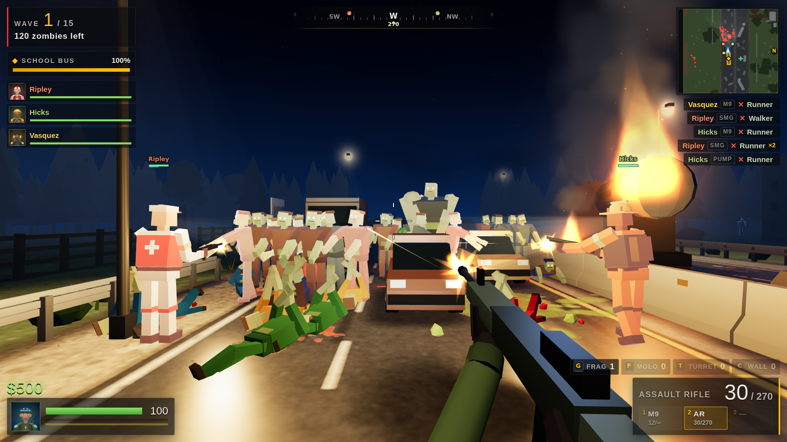

# Highway Horde

A top-down co-op zombie shooter for 1–6 players that runs in the browser. Pick a
survivor, hold the line on a jammed highway, a desert truck stop, a river bridge or an
army checkpoint, and gun down wave after wave of the dead with your friends. Nothing to
install: one person hosts, everyone else opens the invite link.



## What's in it

- **Co-op for 1–6 players over the internet**, with a room code or an invite link, plus
  **AI survivors** to fill empty slots (great for playing solo or with one friend).
  Friends can join a game that's already running.
- **18 guns**: M9 pistol, magnum, sawed-off, micro SMG, pump shotgun, assault rifle, twin
  SMGs, crossbow, battle rifle, sniper, auto shotgun, flamethrower, LMG, grenade launcher,
  rocket launcher, tesla gun, minigun and railgun. There are also frag grenades,
  molotovs, sentry turrets and barricades.
- **8 kinds of zombie**, each with its own trick: walkers, runners, crawlers, bloaters
  that burst, spitters that lob acid, screamers that speed up the horde, charging brutes,
  and an Abomination boss every fifth wave.
- **6 survivor classes**:

  | Class | Role | Perk |
  |---|---|---|
  | Sarge | Soldier | More gun damage and faster reloads |
  | Doc | Medic | Revives twice as fast; teammates nearby heal |
  | Sparks | Engineer | Cheaper, stronger turrets, and starts with one |
  | Swift | Scout | Faster and earns more cash |
  | Boom | Demolitions | Bigger explosions and extra grenades |
  | Tank | Heavy | 150 health and a vest |

- **4 maps**, each built around something to defend: a school bus in a forty-car pileup,
  a diner full of survivors, an APC broken down in the middle of a bridge, and a radio
  tower at a crossroads checkpoint.
- Night-time lighting with flashlights, muzzle flashes, burning wrecks and explosions.
  Blood and scorch marks stay on the ground, and all the sound (every gun, every zombie,
  the music) is synthesised in the browser.
- **Rules:** downed players bleed out unless a teammate revives them. Cash from kills
  buys guns and gear between waves, or mid-wave at the supply station. The game supports
  keyboard and mouse, gamepads, and touch screens.

## Playing with friends

The host's browser runs the game and everyone else connects to it. There are three ways to
put it online; the first is the easiest.

### 1. Static website (no server to run)

Upload the `public/` folder to any static host. With **Netlify** you can drag and drop
the folder onto <https://app.netlify.com/drop>, or connect this repository and set the
base directory to `highway-horde` (the included `netlify.toml` does the rest). GitHub
Pages, Cloudflare Pages and similar hosts work the same way.

Open the site, click **Host Online Game**, then **Copy invite link**, and send the link
to your friends. The game connects players directly to each other (WebRTC, through the
free PeerJS signalling service), so nothing else needs to run.

Direct connections work on most home networks. If a friend can't connect (some
corporate, school or mobile networks block peer-to-peer traffic), use option 2, or add a
TURN server in `public/config.js`.

### 2. Your own server (most reliable)

```bash
cd highway-horde
npm install
npm start            # http://localhost:8080  (set PORT to change it)
```

This serves the game and a small WebSocket relay that forwards traffic between players.
Everyone only talks to your server, so it works on any network. Deploy it to any Node
host that supports WebSockets (Render, Railway, Fly.io, a VPS). To play from your own PC
without deploying, expose it with a tunnel, for example
`cloudflared tunnel --url http://localhost:8080`, and share that URL.

### 3. Same Wi-Fi / LAN

Run `npm start` and have everyone open `http://<your computer's IP>:8080`.

## Controls

| Action | Keyboard & mouse | Gamepad |
|---|---|---|
| Move / aim / shoot | WASD or arrows / mouse / left click | Left stick / right stick / RT |
| Shove | Right click or V | LT or RB |
| Sprint | Shift | Click left stick |
| Reload | R | X |
| Revive (hold) / take crate | E | A |
| Switch weapon | 1 2 3, wheel, Q for last | Y, D-pad ▶ |
| Frag / molotov | G / F | LB / B |
| Turret / barricade | T / C | D-pad ▲ / ▼ |
| Shop | B | Click right stick |
| Ready up (skip the break) | Space | D-pad ◀ |
| Scoreboard / chat / menu | Tab / Enter / Esc | Back / — / Start |

On phones and tablets the left thumb moves, the right thumb aims and fires, and the
other actions have on-screen buttons.

## Tips

- Stay near the objective. Zombies go for whoever is closest, and chew on the
  objective when nobody is around.
- Revive downed teammates by holding E next to them. They have 30 seconds.
- The shop is open between waves. Mid-wave, you can only buy at the supply station.
- Every fifth wave brings a boss. Save a frag or two for it.

## Development

Plain ES modules with no build step, running in the browser as-is. The architecture and
module contracts are described in [SPEC.md](SPEC.md), and the balance data and
reasoning in [docs/BALANCE.md](docs/BALANCE.md).

```bash
npm test                    # unit tests (node:test)
npm run e2e                 # browser tests: solo, 3-player relay, late join, p2p, phone, bots
node scripts/balance.js     # headless bot playtests across maps, difficulties and team sizes
```

The `public/dev/` folder has sandboxes for the renderer, audio, networking and UI.

PeerJS (MIT licence) is vendored in `public/vendor/`.
